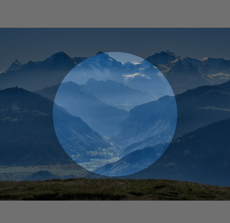
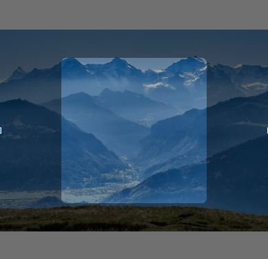
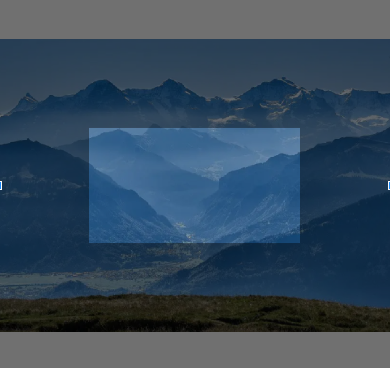

# ClipView
头像、图片裁剪
# 预览
裁剪圆形  
  
裁剪圆角  
    
裁剪矩形  
  
# 资源
|名字|资源|
|-|-|
|AAR|[clip_view.aar](https://github.com/RelinRan/ClipView/blob/master/clip_view.aar)|
|Gitee|[ClipView](https://gitee.com/relin/ClipView)|
|GitHub |[ClipView](https://github.com/RelinRan/ClipView)|
# Maven
1.build.grade | setting.grade
```
repositories {
	...
	maven { url 'https://jitpack.io' }
}
```
2./app/build.grade
```
dependencies {
	implementation 'com.github.RelinRan:ClipView:2022.7.13.1'
}
```
# xml
~~~
<com.androidx.clip.ClipView
   android:id="@+id/clip"
   android:layout_width="match_parent"
   android:layout_height="match_parent"
   app:clipShape="circle"
   app:clipWidth="220dp"
   app:clipHeight="220dp"
   app:clipSrc="@mipmap/ic_001" />
~~~
# attrs.xml
~~~
<!--裁剪宽度-->
<attr name="clipWidth" format="dimension" />
<!--裁剪高度-->
<attr name="clipHeight" format="dimension" />
<!--蒙版颜色-->
<attr name="maskColor" format="color" />
<!--最大缩放值-->
<attr name="maxScale" format="float" />
<!--最小缩放值-->
<attr name="minScale" format="float" />
<!--裁剪图形-->
<attr name="clipShape" format="enum">
    <enum name="rect" value="0" />
    <enum name="circle" value="1" />
    <enum name="round" value="2" />
</attr>
<!--矩形圆角大小-->
<attr name="roundRadius" format="dimension" />
<!--图片来源-->
<attr name="clipSrc" format="reference"/>
~~~
# 使用
~~~
ClipView clip = findViewById(R.id.clip);
clip.setImageResource(R.mipmap.ic_001);
Bitmap bitmap = clip.getClipBitmap();
~~~
